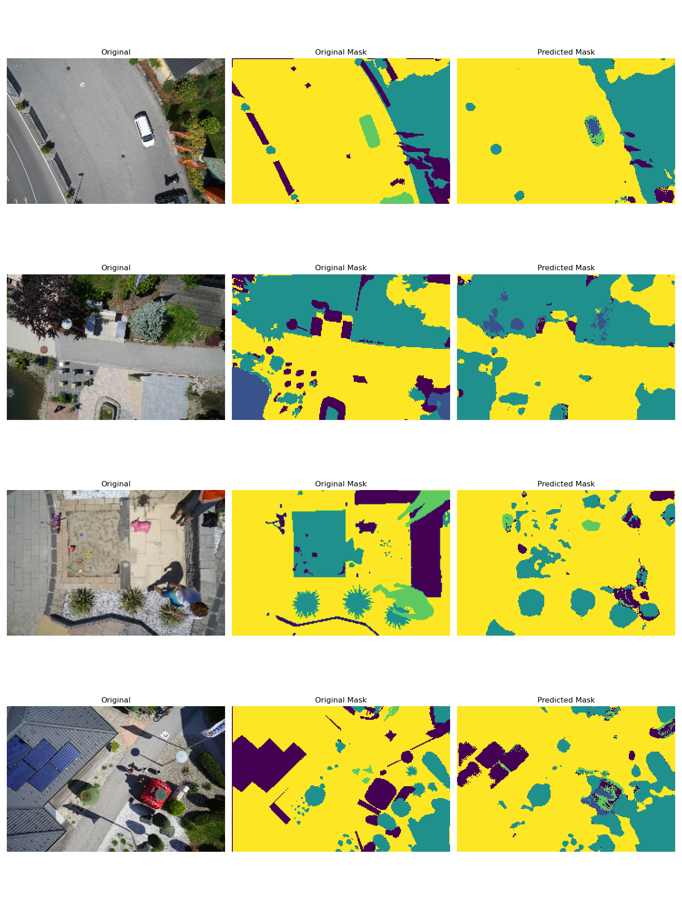

# U-NET
This is Image Segmentation model based on the [U-NET architecture](https://arxiv.org/abs/1505.04597) written from scratch in Pytorch.

The model is trained on 5-class extension of the [Semantic Segmentation Drone Dataset](https://www.kaggle.com/datasets/santurini/semantic-segmentation-drone-dataset)

# Usage Example

